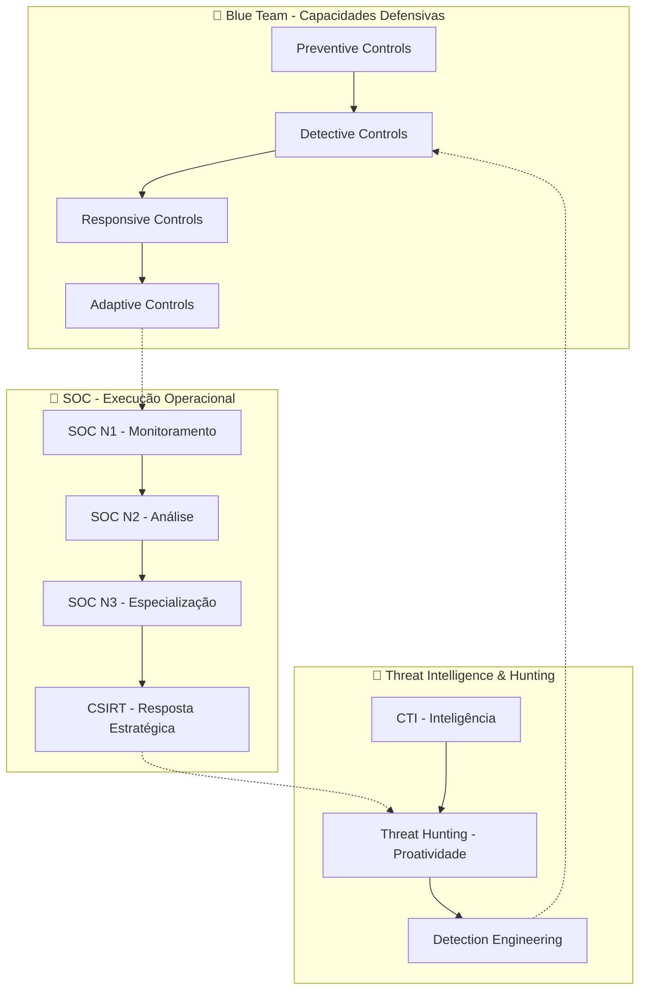
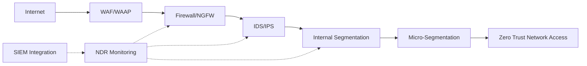
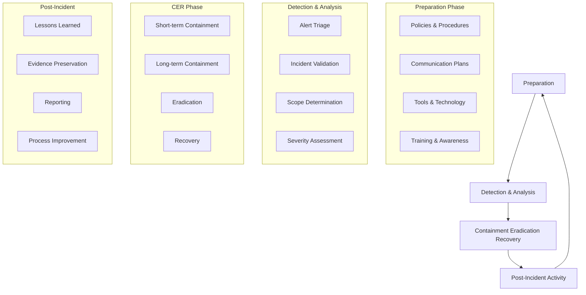

# 🔵 Blue Team / SOC / Security Operations: Guia Completo

> **"Defesa não é apenas reagir - é antecipar, detectar, conter e evoluir continuamente"**  
> O ecossistema de segurança defensiva em profundidade

## 🎯 Visão Geral Estratégica

A **segurança defensiva moderna** é um **sistema integrado** que combina **capacidades preventivas, detectivas e responsivas** para proteger organizações contra ameaças cibernéticas. Este guia cobre toda a **trilha defensiva**, desde conceitos fundamentais até operações avançadas.

---

## 📊 Arquitetura da Defesa em Profundidade Moderna



---

# 🧩 PARTE 1 — FUNDAÇÕES DO BLUE TEAM
## Capacidades Defensivas Estratégicas

## 🔵 O Que É Realmente Blue Team?

**Blue Team ≠ apenas SOC**. É o **conjunto de todas as capacidades defensivas** que atuam **antes, durante e depois** de um ataque, baseando-se em três pilares:

### 🛡️ **Tríade Defensiva**
```
┌─────────────────────────────────────────────┐
│            DEFESA PROATIVA                  │
│  • Hardening & Baseline                     │
│  • Patch Management                         │
│  • Security Awareness                       │
│  • Architecture Reviews                     │
└─────────────────────────────────────────────┘
             ↓
┌─────────────────────────────────────────────┐
│           DEFESA DETECTIVA                  │
│  • SIEM Correlation                         │
│  • Behavioral Analytics                     │
│  • Threat Hunting                           │
│  • Anomaly Detection                        │
└─────────────────────────────────────────────┘
             ↓
┌─────────────────────────────────────────────┐
│           DEFESA RESPONSIVA                 │
│  • Incident Response                        │
│  • Containment & Eradication               │
│  • Forensic Analysis                       │
│  • Lessons Learned                         │
└─────────────────────────────────────────────┘
```

### 📈 **Matriz de Maturidade Defensiva**
| Nível | Características | Foco | Exemplo de Métricas |
|-------|----------------|------|---------------------|
| **Reativo** | Resposta a alertas apenas | SOC N1 básico | Nº de tickets tratados |
| **Proativo** | Threat hunting, regras custom | SOC N2/N3 | MTTD < 1h, FP rate < 20% |
| **Preventivo** | Hardening, baseline, patch | Blue Team + Infra | Reduction in attack surface |
| **Predictivo** | CTI-driven, ML, automation | Advanced Blue Team | Predictive threat scores |
| **Adaptativo** | Auto-learning, auto-remediation | AIOps, SOAR avançado | Autonomous response rate |

---

## 🏗️ Domínios Operacionais do Blue Team (Expansão Detalhada)

### **🔍 Detection & Response (Core SOC Operations)**
| Componente | Função | Tecnologias | KPIs |
|------------|--------|-------------|------|
| **SIEM** | Correlação central | Splunk, Elastic, Sentinel, QRadar | Log ingestion rate, Alert fidelity |
| **EDR/XDR** | Detecção endpoint | CrowdStrike, Defender, SentinelOne | Mean Time to Detect (MTTD) |
| **NDR** | Detecção rede | Vectra, Darktrace, ExtraHop | Network anomaly detection rate |
| **UEBA** | Anomalias comportamentais | Exabeam, Splunk UBA | User/entity risk scoring accuracy |

### **🎯 Exposure Management (Gevul 2.0)**
```yaml
Modern Vulnerability Management:
  Asset Discovery:
    - Active scanning (Nessus, Qualys)
    - Passive discovery (NMAP, Shodan)
    - Cloud asset inventory (CSPM)
  
  Vulnerability Assessment:
    - CVSS scoring + context
    - EPSS (Exploit Prediction Scoring System)
    - Threat intelligence correlation
  
  Risk-Based Prioritization:
    - Asset criticality + exploit likelihood + business impact
    - Automated ticket creation (Jira, ServiceNow)
  
  Continuous Monitoring:
    - DAST/SAST integration
    - External attack surface monitoring
    - Dark web monitoring
```

### **🌐 Network Security Controls (Defesa em Camadas)**


### **🔐 Application & API Security**
| Camada | Tecnologias | Integração SOC | Responsabilidade |
|--------|-------------|----------------|------------------|
| **WAF** | Cloudflare, Akamai, Imperva | Alertas de ataques web | SOC N1/N2 |
| **API Security** | Noname, Salt, 42Crunch | Detecção abuso API | SOC N2 + AppSec |
| **Bot Management** | Distil, Kasada | Mitigação scraping | SOC N1 |
| **RASP** | Contrast, Immunio | Runtime protection | DevSecOps |

### **🖥️ Endpoint Protection Evolution**
```
EDR 1.0 (2013-2018):
  • Signature-based
  • Post-compromise focus
  • Manual investigation

EDR 2.0 / XDR (2018-2023):
  • Behavioral analytics
  • Cross-layer correlation
  • Automated response

EDR 3.0 / AI-Driven (2024+):
  • Predictive threat prevention
  • Autonomous remediation
  • Identity-centric protection
```

### **🧠 Threat-Informed Defense (CTI Integration)**
```python
# Exemplo: CTI-Driven Detection Rule
def create_cti_detection_rule(threat_actor, ioc_type, ttp):
    """
    Cria regra de detecção baseada em CTI
    """
    rule = {
        "name": f"TA_{threat_actor}_{ttp}",
        "description": f"Detection for {threat_actor} using {ttp}",
        "severity": calculate_risk_score(threat_actor),
        "data_sources": get_relevant_logs(ttp),
        "detection_logic": build_sigma_rule(ttp),
        "response_playbook": f"respond_to_{threat_actor}"
    }
    return rule
```

### **🤖 Automation & Orchestration (SOAR Maturity)**
| Nível | Automação | Exemplos | ROI |
|-------|-----------|----------|-----|
| **Level 1** | Playbooks manuais | Runbooks em PDF | Baixo |
| **Level 2** | Semi-automated | SOAR with human approval | Médio |
| **Level 3** | Automated response | Auto-contain, auto-block | Alto |
| **Level 4** | Intelligent automation | ML-driven decisions | Transformacional |

### **📊 Logging & Telemetry Strategy**
```
TIER 1 - CRITICAL (Retention: 2+ years)
  • Authentication logs
  • Security events
  • Network flow data
  • EDR telemetry

TIER 2 - IMPORTANT (Retention: 1 year)
  • System logs
  • Application logs
  • Database audit trails
  • Cloud API calls

TIER 3 - CONTEXTUAL (Retention: 90 days)
  • Performance metrics
  • Operational logs
  • Debug information
```

### **🛡️ Hardening & Preventive Controls**
```yaml
Defense-in-Depth Hardening:
  OS Level:
    - CIS Benchmarks compliance
    - Least privilege principle
    - Application whitelisting
    - Memory protection (ASLR, DEP)
  
  Network Level:
    - Segmentation (VLANs, microsegmentation)
    - Port security
    - MAC address filtering
    - Network access control (NAC)
  
  Cloud Level:
    - Identity and Access Management (IAM)
    - Resource tagging and classification
    - Encryption at rest and in transit
    - Backup and disaster recovery
```

---

# 🏢 PARTE 2 — SOC (SECURITY OPERATIONS CENTER)
## Modelo Operacional e Execução

## 🎯 Modelos SOC: Escolha o Certo para Sua Organização

### **📊 Modelos Operacionais**
| Modelo | Tamanho Ideal | Vantagens | Desafios |
|--------|---------------|-----------|----------|
| **SOC Interno** | 1000+ funcionários | Controle total, contexto interno | Custo alto, retenção talentos |
| **MSSP Gerenciado** | 50-500 funcionários | Custo previsível, expertise | Contexto limitado, integração |
| **Hybrid SOC** | 500-5000 funcionários | Flexibilidade, escalabilidade | Gestão complexa, coordenação |
| **SOC-as-a-Service** | Startups, empresas pequenas | Pay-as-you-go, sem overhead | Personalização limitada |
| **Fusion Center** | Grandes corporações | Integração física/digital | Complexidade organizacional |

### **⏰ Modelos de Turno (Follow-the-Sun)**
```yaml
8x5 Model (Basic):
  • Seg-Sex, 9h-18h
  • Para empresas com risco baixo
  • Outside hours: on-call rotation

24x7 Model (Enterprise):
  • 3 turnos de 8 horas
  • Cobertura contínua
  • Requer 5-7 FTE por turno

Follow-the-Sun (Global):
  • SOCs em múltiplos fusos horários
  • Sem trabalho noturno local
  • Coordenação entre regiões
```

---

## 👥 Estrutura de Carreira e Papéis SOC

### **🟢 SOC Analyst N1 — Foundation Layer**
```
REQUISITOS TÉCNICOS:
  • Understanding of networking fundamentals
  • Basic OS knowledge (Windows/Linux)
  • Familiarity with security concepts
  • Ability to follow runbooks

RESPONSABILIDADES:
  • Monitor security dashboards (90%)
  • Triage and categorize alerts (5%)
  • Execute basic containment (3%)
  • Document incidents (2%)

FERRAMENTAS:
  • SIEM dashboards
  • Ticketing system (ServiceNow, Jira)
  • Basic EDR console
  • Communication tools (Slack, Teams)

METAS DE PERFORMANCE:
  • Time to acknowledge: < 5 min
  • False positive rate: < 30%
  • Escalation accuracy: > 85%
```

### **🟡 SOC Analyst N2 — Technical Analysis**
```
REQUISITOS AVANÇADOS:
  • Network protocol analysis (TCP/IP, HTTP, DNS)
  • Malware analysis basics
  • Scripting (Python, PowerShell)
  • Log analysis expertise

RESPONSABILIDADES:
  • Deep dive investigations (40%)
  • Threat hunting assistance (20%)
  • Rule tuning and optimization (15%)
  • Playbook development (15%)
  • Mentor N1 analysts (10%)

FERRAMENTAS ESPECIALIZADAS:
  • Packet analyzers (Wireshark)
  • Malware sandboxes (Any.Run, Hybrid-Analysis)
  • Forensic tools (Autopsy, FTK)
  • Threat intelligence platforms

KPIs:
  • Mean Time to Resolution (MTTR): < 4h
  • Detection accuracy: > 90%
  • Playbook effectiveness: > 75%
```

### **🔴 SOC Analyst N3 / Detection Engineer — Specialization**
```
ÁREAS DE ESPECIALIZAÇÃO:
  1. Detection Engineering
  2. Threat Hunting
  3. DFIR (Digital Forensics & Incident Response)
  4. Cloud Security
  5. Automation & SOAR

COMPETÊNCIAS:
  • Advanced threat analysis
  • Sigma/YARA rule creation
  • MITRE ATT&CK mapping
  • API integration development
  • Machine learning basics for security

ENTREGÁVEIS:
  • Custom detection rules (Sigma, Splunk)
  • Threat hunting hypotheses
  • Automated response playbooks
  • Security architecture recommendations
  • Training materials for N1/N2

FERRAMENTAS AVANÇADAS:
  • Git for detection-as-code
  • Jupyter notebooks for analysis
  • Custom scripting frameworks
  • Cloud security tools (CSPM, CNAPP)
```

### **👑 SOC Manager / Team Lead**
```
RESPONSABILIDADES ESTRATÉGICAS:
  • Team management and development
  • Budget planning and justification
  • Vendor management and evaluation
  • Stakeholder communication
  • Process optimization

METRICAIS EXECUTIVAS:
  • SOC ROI and value demonstration
  • Risk reduction metrics
  • Compliance reporting
  • Incident trend analysis
  • Capacity planning

HABILIDADES:
  • Project management (Agile, Scrum)
  • Financial acumen (budget, TCO, ROI)
  • Executive communication
  • Strategic planning
```

---

## 🔁 Processos Operacionais do SOC

### **🔄 Incident Response Lifecycle (NIST)**


### **📋 Playbooks por Tipo de Incidente**
```yaml
Malware Infection:
  Detection:
    - EDR alert on malicious process
    - AV detection
    - Network IOC match
  
  Triage:
    - Isolate endpoint
    - Collect artifacts (memory, disk)
    - Check lateral movement
  
  Containment:
    - Network isolation
    - Disable user account
    - Block malicious domains/IPs
  
  Eradication:
    - Malware removal
    - Password resets
    - System rebuild if necessary
  
  Recovery:
    - Restore from clean backup
    - Verify system integrity
    - Monitor for recurrence

Phishing Campaign:
  Detection:
    - Email security gateway alert
    - User reports
    - URL analysis
  
  Response:
    - Quarantine emails
    - Block malicious URLs
    - User awareness notification
  
  Investigation:
    - Email header analysis
    - Attachments analysis
    - Campaign scope determination
```

---

## 🟥 CSIRT — Resposta Estratégica a Incidentes

### **🎯 Quando Ativar o CSIRT?**
```
TIER 1 - SOC Only:
  • Single endpoint malware
  • Basic phishing campaign
  • Low-impact DDoS

TIER 2 - CSIRT Activation:
  • Data breach suspected
  • Ransomware infection
  • Advanced persistent threat
  • Regulatory reporting required

TIER 3 - Executive Crisis Management:
  • Nation-state attack
  • Critical infrastructure impact
  • Significant financial loss
  • Major reputation damage
```

### **👥 Composição do CSIRT**
| Papel | Responsabilidades | Departamento |
|-------|------------------|--------------|
| **CSIRT Lead** | Coordenação geral, decisões estratégicas | Security |
| **Technical Lead** | Análise técnica aprofundada | SOC N3 |
| **Legal Counsel** | Implicações legais, notificações | Legal |
| **Comms Lead** | Comunicação interna/externa | PR/Comms |
| **IT Operations** | Recuperação de sistemas | IT Ops |
| **Business Continuity** | Garantia continuidade operacional | BCP |
| **HR Representative** | Questões pessoas/employer | RH |

---

## 📊 Métricas e KPIs do SOC

### **🎯 Métricas Operacionais (Táticos)**
| Métrica | Fórmula | Meta | Significado |
|---------|---------|------|-------------|
| **MTTD** | (Detection Time - Incident Start) | < 1 hora | Quão rápido detectamos |
| **MTTR** | (Resolution Time - Detection Time) | < 4 horas | Quão rápido resolvemos |
| **Alert Volume** | Nº alerts / dia | Baselines | Carga de trabalho |
| **False Positive Rate** | FP / Total Alerts | < 20% | Eficiência detecção |
| **Escalation Rate** | Escalated / Total | 10-20% | Balance N1 vs N2 |
| **SLA Compliance** | Met SLA / Total | > 95% | Performance operacional |

### **📈 Métricas Estratégicas (Executivas)**
```yaml
Business Value Metrics:
  Risk Reduction:
    - Mean time between incidents
    - Reduction in successful attacks
    - Decrease in financial impact
  
  Efficiency Metrics:
    - Cost per alert handled
    - Automation rate (% auto-contained)
    - Analyst productivity (alerts/analyst/day)
  
  Coverage Metrics:
    - MITRE ATT&CK technique coverage
    - Asset coverage (% monitored)
    - Detection coverage across kill chain
  
  Quality Metrics:
    - Threat detection accuracy
    - Incident report quality scores
    - Stakeholder satisfaction surveys
```

### **📊 SOC Dashboard Exemplo**
```
REAL-TIME METRICS:
  • Active Incidents: 12
  • High Severity: 3
  • Mean Time to Detect: 45min
  • Analyst Availability: 8/10
  
TOP THREATS (24h):
  1. Phishing Campaign (45%)
  2. Malware Downloads (30%)
  3. Credential Stuffing (15%)
  4. Data Exfiltration Attempts (10%)
  
AUTOMATION STATUS:
  • Automated Containments: 68%
  • Playbook Execution: 42
  • False Positives Filtered: 1,234
  
TEAM PERFORMANCE:
  • Tickets Closed: 156
  • Escalation Accuracy: 92%
  • SLA Compliance: 97%
```

---

# 🧠 PARTE 3 — THREAT HUNTING E ENGENHARIA DE DETECÇÃO

## 🔍 Threat Hunting Methodology

### **🎯 Modelos de Hunting**
```yaml
Hypothesis-Driven Hunting:
  1. Formulate hypothesis (based on CTI, TTPs)
  2. Identify data sources needed
  3. Develop search queries
  4. Execute and analyze results
  5. Document findings and create detections

Indicator-Driven Hunting:
  1. Receive IOCs (hashes, IPs, domains)
  2. Search across all data sources
  3. Identify compromised systems
  4. Scope the incident
  5. Initiate response

TTP-Driven Hunting:
  1. Select MITRE ATT&CK technique
  2. Understand execution methods
  3. Identify log sources that would show activity
  4. Search for anomalous patterns
  5. Correlate with other techniques
```

### **🛠️ Threat Hunting Toolkit**
```python
class ThreatHunter:
    def __init__(self):
        self.data_sources = {
            'endpoint': ['EDR', 'Windows Events', 'Sysmon'],
            'network': ['Firewall', 'Proxy', 'DNS', 'NetFlow'],
            'cloud': ['CloudTrail', 'Azure Logs', 'GCP Audit'],
            'identity': ['AD Logs', 'Okta', 'Azure AD']
        }
    
    def hunt_technique(self, technique_id, time_range='7d'):
        """Hunt for specific MITRE ATT&CK technique"""
        queries = self.get_queries_for_technique(technique_id)
        results = []
        
        for query in queries:
            data_source = query['data_source']
            search_query = query['query']
            results.append(self.search(data_source, search_query, time_range))
        
        return self.analyze_results(results)
    
    def create_hypothesis(self, threat_actor, campaign):
        """Formulate hunting hypothesis"""
        hypothesis = f"{threat_actor} may be using {campaign} techniques"
        ttp_list = self.get_ttps_for_actor(threat_actor)
        return hypothesis, ttp_list
```

### **📊 Hunting Metrics**
- Hypotheses tested per week
- Findings vs. false positives ratio
- Time from hypothesis to detection creation
- Coverage of MITRE ATT&CK matrix
- Impact of findings (critical/high/medium/low)

---

## ⚙️ Detection Engineering

### **🔄 Detection-as-Code Workflow**
```
1. THREAT INTELLIGENCE
   ↓
2. TTP ANALYSIS
   ↓
3. RULE DEVELOPMENT (Sigma/YARA)
   ↓
4. TESTING (Detection Lab)
   ↓
5. DEPLOYMENT (GitOps)
   ↓
6. VALIDATION (Production)
   ↓
7. MONITORING & TUNING
   ↓
8. RETIREMENT (When obsolete)
```

### **📝 Sigma Rule Example**
```yaml
title: Suspicious PowerShell Download
id: 3a8c2c5d-3c3b-4b7a-9b2c-1a2b3c4d5e6f
status: experimental
description: Detects suspicious PowerShell download patterns
references:
  - https://attack.mitre.org/techniques/T1059/001/
author: Detection Engineering Team
date: 2024-01-15
tags:
  - attack.execution
  - attack.t1059.001
logsource:
  product: windows
  service: powershell
detection:
  selection:
    CommandLine|contains:
      - 'Invoke-WebRequest'
      - 'Invoke-RestMethod'
      - 'System.Net.WebClient'
      - 'DownloadString'
      - 'DownloadFile'
  filter:
    CommandLine|contains:
      - 'microsoft.com'
      - 'windowsupdate.com'
  condition: selection and not filter
falsepositives:
  - Legitimate software updates
  - Administrative scripts
level: high
```

### **🎯 Detection Quality Framework**
```yaml
Quality Dimensions:
  Accuracy:
    - True positive rate
    - False positive rate
    - Precision and recall
  
  Coverage:
    - MITRE ATT&CK coverage
    - Data source coverage
    - Asset coverage
  
  Performance:
    - Query execution time
    - Resource consumption
    - Scalability
  
  Maintainability:
    - Documentation quality
    - Test coverage
    - Version control
  
  Operational Fit:
    - Integration with SOAR
    - Alert fatigue consideration
    - Analyst understanding
```

---

## 🤖 Automação e SOAR (Security Orchestration, Automation & Response)

### **🏗️ SOAR Architecture Components**
```
┌─────────────────────────────────────────────────┐
│              PRESENTATION LAYER                  │
│  • Dashboards & Visualizations                   │
│  • Case Management Interface                     │
│  • Playbook Designer GUI                         │
└─────────────────────────────────────────────────┘
                            ↓
┌─────────────────────────────────────────────────┐
│                ORCHESTRATION LAYER              │
│  • Workflow Engine                              │
│  • Decision Engine                              │
│  • Integration Framework                         │
└─────────────────────────────────────────────────┘
                            ↓
┌─────────────────────────────────────────────────┐
│                INTEGRATION LAYER                │
│  • Connectors & Adapters                        │
│  • API Management                               │
│  • Data Normalization                           │
└─────────────────────────────────────────────────┘
                            ↓
┌─────────────────────────────────────────────────┐
│                DATA LAYER                       │
│  • Case Database                                │
│  • Artifact Storage                             │
│  • Playbook Repository                          │
└─────────────────────────────────────────────────┘
```

### **🔄 Playbook Automation Examples**
```python
class AutomatedResponse:
    def handle_malware_incident(self, alert):
        """Automated malware containment playbook"""
        
        # Step 1: Validate alert
        if not self.validate_alert(alert):
            return "Alert validation failed"
        
        # Step 2: Isolate endpoint
        endpoint_id = alert['endpoint_id']
        self.edr.isolate_endpoint(endpoint_id)
        
        # Step 3: Collect forensic artifacts
        artifacts = self.edr.collect_artifacts(endpoint_id)
        
        # Step 4: Block malicious indicators
        for ioc in alert['iocs']:
            self.firewall.block_ioc(ioc)
            self.proxy.block_domain(ioc['domain'])
        
        # Step 5: Create investigation ticket
        ticket = self.ticketing.create_incident_ticket(
            title=f"Malware Incident: {endpoint_id}",
            description=self.generate_report(alert, artifacts),
            priority="High"
        )
        
        # Step 6: Notify stakeholders
        self.notify.stakeholders(ticket)
        
        return f"Incident {ticket['id']} created and automated response completed"
```

### **📈 SOAR Maturity Model**
| Nível | Automação | Exemplo | ROI |
|-------|-----------|---------|-----|
| **Level 0** | Manual | Everything done manually | N/A |
| **Level 1** | Basic | Automated ticket creation | 10-20% |
| **Level 2** | Partial | Auto-enrichment with CTI | 30-40% |
| **Level 3** | Advanced | Auto-containment for known threats | 50-70% |
| **Level 4** | Intelligent | ML-driven decision making | 80%+ |
| **Level 5** | Autonomous | Self-healing systems | 90%+ |

---

## 🏆 Progressão de Carreira e Certificações

### **🗺️ Roadmap de Carreira**
```
ENTRY LEVEL (0-2 years):
  → SOC Analyst N1
  → Security Operations Associate
  → Junior Security Analyst
  
MID-LEVEL (2-5 years):
  → SOC Analyst N2
  → Threat Analyst
  → Security Engineer
  
SENIOR LEVEL (5-8 years):
  → SOC Analyst N3
  → Detection Engineer
  → Threat Hunter
  → Incident Responder
  
LEADERSHIP (8+ years):
  → SOC Manager
  → Security Operations Manager
  → Head of SOC
  → Director of Security Operations
  
SPECIALIZATION PATHS:
  • Cloud Security Operations
  • Detection Engineering
  • Threat Intelligence
  • DFIR Specialist
  • Security Automation
```

### **🎓 Certificações por Nível**
```yaml
Entry Level:
  - CompTIA Security+
  - Cisco CCNA CyberOps
  - Microsoft SC-900
  - GIAC GSEC

Intermediate Level:
  - CompTIA CySA+
  - GIAC GCIA
  - GIAC GCIH
  - EC-Council CND
  - Microsoft SC-200

Advanced Level:
  - GIAC GCDA
  - GIAC GNFA
  - GIAC GCTI
  - Offensive Security OSDA
  - SANS SEC555

Leadership:
  - CISSP
  - CISM
  - CRISC
  - SANS MGT512
```

### **📚 Stack de Aprendizado por 90 Dias**
```
WEEK 1-4: Foundations
  • Networking fundamentals
  • Windows/Linux basics
  • Security concepts
  • SIEM navigation

WEEK 5-8: Core Skills
  • Log analysis
  • Basic scripting
  • Alert triage
  • Incident response basics

WEEK 9-12: Specialization
  • Choose path: Detection/Threat Hunting/DFIR
  • Build home lab
  • Practice on cyber ranges
  • Earn first certification
```

---

## 🧪 Labs e Ambientes de Prática

### **🔬 Home Lab Setup**
```yaml
Basic SOC Lab ($0-500):
  Hardware:
    - Old laptop/desktop (16GB RAM minimum)
    - External hard drive for storage
  
  Software:
    - VirtualBox/VMware Workstation Player
    - Security Onion (SIEM/IDS)
    - Wazuh (Open Source EDR/SIEM)
    - Metasploitable (Vulnerable VMs)
    - Windows/Linux VMs for testing
  
  Cloud Lab (AWS/GCP Free Tier):
    - Elastic SIEM on EC2
    - Wazuh Cloud
    - TryHackMe/Azure Labs

Enterprise Simulation ($500-2000):
  - Splunk Enterprise (Free up to 500MB/day)
  - Elastic Stack
  - Caldera (Adversary Emulation)
  - Atomic Red Team (Testing Framework)
```

### **🎮 Plataformas de Treinamento**
| Plataforma | Foco | Custo | Melhor Para |
|------------|------|-------|-------------|
| **TryHackMe** | SOC Path, Blue Team | $10-20/mês | Iniciantes, fundamentos |
| **LetsDefend** | SOC Simulation | $29-99/mês | Experiência realista SOC |
| **CyberDefenders** | CTFs Blue Team | Free/Premium | Desafios práticos |
| **RangeForce** | Skills Development | Enterprise | Treinamento corporativo |
| **Blue Team Labs** | SOC Scenarios | $50/mês | Cenários realistas |
| **DetectionLab** | Local Lab Setup | Free | Ambiente de detecção |

---

## 📚 Bibliografia Essencial

### **📘 Livros Fundamentais**
```yaml
SOC Operations:
  - "The Practice of Network Security Monitoring" by Richard Bejtlich
  - "Applied Network Security Monitoring" by Chris Sanders
  - "Security Operations Center: Building, Operating, and Maintaining your SOC" by Joseph Muniz

Detection Engineering:
  - "The Threat Hunter's Handbook" by Chris Peake
  - "Practical Threat Intelligence and Data-Driven Threat Hunting" by Valentina Costa-Gazcon

Incident Response:
  - "Incident Response & Computer Forensics" by Jason Luttgens et al.
  - "Blue Team Handbook: Incident Response Edition" by Don Murdoch

Threat Intelligence:
  - "Intelligence-Driven Incident Response" by Scott Roberts
  - "The CTI Blueprint" by Joshua Pennell
```

### **📰 Blogs e Recursos Online**
```
Daily Reading:
  • Krebs on Security
  • The DFIR Report
  • SANS Internet Storm Center
  • Microsoft Security Blog
  
Technical Resources:
  • Sigma Rules Repository
  • MITRE ATT&CK Framework
  • Detection as Code Community
  • Awesome Threat Detection
  
Newsletters:
  • SANS NewsBites
  • Krebs Security
  • ThreatPost
  • The Record by Recorded Future
```

---

## 🚀 Tendências e Futuro do Blue Team

### **🔮 2024-2025 Predictions**
```yaml
AI & Machine Learning:
  - Predictive threat detection
  - Automated threat hunting
  - Natural language querying of logs
  - AI-assisted incident response

Cloud-Native SOC:
  - Cloud-scale log analytics
  - Serverless detection engines
  - Native cloud security integrations
  - Container runtime protection

Extended Detection (XDR):
  - Unified security operations platform
  - Cross-layer correlation at scale
  - Automated investigation workflows
  - Integrated threat intelligence

Zero Trust Integration:
  - Continuous authentication monitoring
  - Device health integration with SOC
  - Policy violation detection
  - Identity threat detection and response

Skills Evolution:
  - More coding skills required
  - Cloud security expertise essential
  - Data science skills for detection engineering
  - Business acumen for risk communication
```

### **🎯 Competências Emergentes**
```
Must-Have Skills (2024+):
  • Cloud Security (AWS/Azure/GCP)
  • Scripting and Automation (Python)
  • Data Analysis (SQL, Pandas)
  • Container Security (Kubernetes)
  • Detection-as-Code (Git, CI/CD)

Nice-to-Have Skills:
  • Machine Learning Basics
  • DevOps/DevSecOps Practices
  • Threat Intelligence Analysis
  • Compliance Frameworks
  • Business Risk Communication
```

---

## ⚠️ Desafios Comuns e Soluções

### **🚧 Desafios Operacionais**
```
Alert Fatigue:
  SOLUTION: Implement risk-based alert prioritization
  TOOLS: UEBA, ML-based filtering
  PROCESS: Regular rule tuning and retirement

Skill Shortage:
  SOLUTION: Implement tiered SOC model
  TOOLS: Automation to reduce manual work
  PROCESS: Cross-training and career path development

Tool Sprawl:
  SOLUTION: XDR consolidation
  TOOLS: API integrations, SOAR
  PROCESS: Regular tool rationalization

Budget Constraints:
  SOLUTION: Open source alternatives
  TOOLS: Wazuh, Security Onion, Elastic
  PROCESS: Cloud-native, pay-as-you-go models
```

### **✅ Melhores Práticas Comprovadas**
```
1. START WITH LOGGING:
   • Enable comprehensive logging first
   • Centralize before analyzing
   • Focus on quality over quantity

2. MEASURE WHAT MATTERS:
   • Track MTTD and MTTR religiously
   • Focus on business impact reduction
   • Report security ROI to leadership

3. AUTOMATE RUTINE TASKS:
   • Automate enrichment first
   • Then containment for known threats
   • Finally, automate investigation steps

4. INVEST IN PEOPLE:
   • Continuous training and certification
   • Clear career progression paths
   • Healthy work-life balance (burnout prevention)

5. EMBRACE CONTINUOUS IMPROVEMENT:
   • Regular purple team exercises
   • Lessons learned from incidents
   • Stay current with threat landscape
```

---

## 🎯 Conclusão: O Futuro do Blue Team

O Blue Team moderno evoluiu de **centro de monitoramento reativo** para **função estratégica de redução de risco**. 

### **✨ Princípios Fundamentais**
1. **Contexto é Rei** - Sem entendimento do negócio, não há defesa eficaz
2. **Automação Liberta** - Automatize o rotineiro, humanize o estratégico
3. **Dados Informam** - Decisões baseadas em dados, não em suposições
4. **Colaboração Vence** - Purple teaming, não silos
5. **Melhoria Contínua** - Nunca "acabado", sempre evoluindo

### **🌟 Visão para 2026**
> "O Blue Team de sucesso não será medido por quantos alertas processa,  
> mas por quão bem antecipa e impede incidentes que impactam o negócio."

---

<div align="center">

## 🔗 Recursos e Comunidade

**📚 Aprendizado Contínuo:**
- [SANS Blue Team Podcast](https://www.sans.org/podcasts/blue-team/)
- [DFIR Discord Community](https://discord.gg/dfir)
- [Security Blue Team](https://securityblue.team/)

**🛠️ Ferramentas Open Source:**
- [Wazuh](https://wazuh.com/) - XDR Open Source
- [Security Onion](https://securityonion.net/) - SIEM/IDS
- [Elastic Security](https://www.elastic.co/security) - SIEM/Endpoint

**🎓 Treinamento Gratuito:**
- [TryHackMe SOC Path](https://tryhackme.com/path/outline/soc)
- [LetsDefend Free Tier](https://letsdefend.io/)
- [Blue Team Labs Online](https://blueteamlabs.online/)

---

*"A segurança não é um destino, é uma jornada.  
Celebre as pequenas vitórias, aprenda com cada desafio,  
e continue construindo defesas mais resilientes a cada dia."*

</div>
```


Perfeito para profissionais que buscam aprofundar conhecimento ou organizações estruturando suas operações de segurança!
