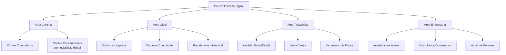
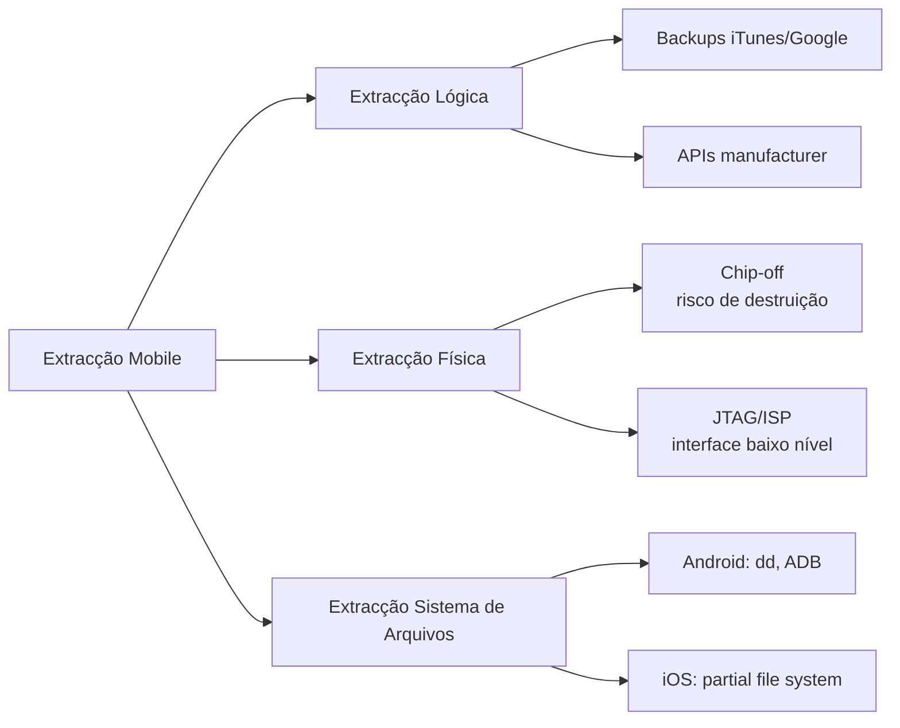
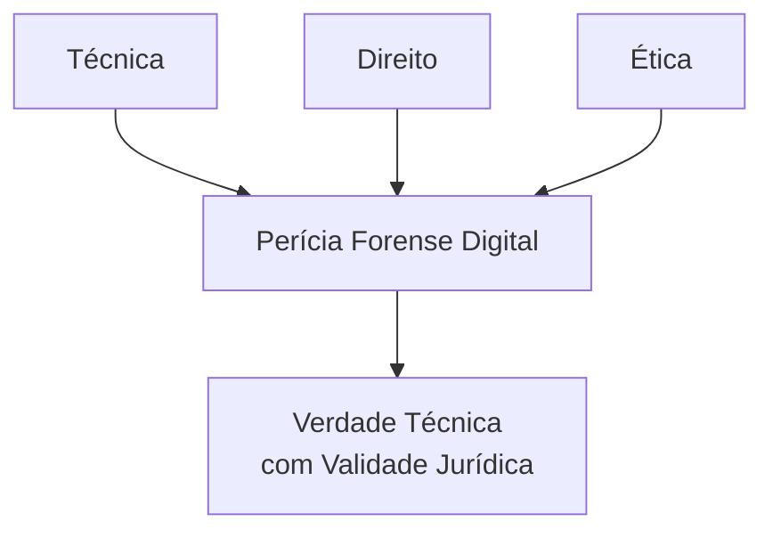

# 🔍 Perícia Forense Digital: Guia Completo

> **"A verdade não existe apenas, ela precisa ser provada"** - Técnicas de investigação digital com validade jurídica

## 📖 Definição & Propósito

A **Perícia Forense Digital** é a disciplina científica que aplica **métodos sistemáticos** para coletar, preservar, analisar e apresentar evidências digitais de forma **juridicamente válida, técnica e imparcial**.

### 🎯 Objetivos Primários
- **Produzir prova técnica** para suporte jurídico
- **Reconstituir eventos digitais** com precisão cronológica
- **Estabelecer autoria e intencionalidade** em ações digitais
- **Preservar a integridade** da cadeia probatória
- **Traduzir complexidade técnica** em linguagem acessível ao Judiciário

### ⚖️ Contextos de Aplicação


---

## ⚡ DFIR vs. Perícia Forense Digital: Comparação Detalhada

| **Dimensão** | **DFIR (Digital Forensics & Incident Response)** | **Perícia Forense Digital** |
|--------------|--------------------------------------------------|-----------------------------|
| **🏁 Objetivo Principal** | Conter incidentes, minimizar danos, restaurar operações | Gerar prova técnica válida juridicamente |
| **⏱️ Tempo de Resposta** | Horas a dias (urgência operacional) | Dias a meses (rigor metodológico) |
| **🎯 Foco** | Defesa do ambiente, proteção ativa | Neutralidade, imparcialidade técnica |
| **⚖️ Contexto Legal** | Pode originar evidências para perícia posterior | Próprio processo é o contexto legal |
| **🔗 Cadeia de Custódia** | Importante para integridade | **Crítica e obrigatória** - sem ela, sem prova |
| **📊 Saída Principal** | Relatório de incidente, alertas, medidas corretivas | **Laudo Pericial** com validade jurídica |
| **👥 Destinatário** | Equipe de segurança, gestores, SOC, CISO | Juízes, promotores, advogados, partes |
| **🔄 Reversibilidade** | Ações podem ser revertidas para restauração | **Nada é alterado** - apenas cópias forenses |
| **💼 Responsabilidade** | Proteger a organização | Servir à Justiça/Tribunal |

### 📌 Analogia Prática
```
🏥 DFIR = Médico de emergência
   • Age rápido para salvar o paciente
   • Foco na sobrevivência imediata
   • Documenta para prontuário

⚖️ Perícia Forense = Médico legista
   • Examina metodicamente
   • Estabelece causa da morte
   • Produz laudo para autoridade
```

---

## 👨‍⚖️ Atuação Profissional: Especializações

### **1. Perito Oficial (Nomeado pelo Juízo)**
- Nomeado pelo magistrado
- Dever de imparcialidade absoluta
- Remuneração pelo tribunal
- Responde apenas ao juiz

### **2. Assistente Técnico (Das Partes)**
- Contratado por uma das partes
- Pode sugerir quesitos/diligências
- Analisa laudo do perito oficial
- Representa interesses técnicos da parte

### **3. Perito Corporativo/Privado**
- Funcionário ou consultor da empresa
- Investigações internas (compliance, fraudes)
- Preparação para ações judiciais
- Segue padrões forenses, mas sem vínculo judicial

### **4. Perito Criminal (Órgãos Públicos)**
- Integra polícia científica ou federal
- Atua em investigações criminais
- Segue procedimentos institucionais específicos
- Frequentemente atua em conjunto com investigadores

---

## 🧬 Princípios Fundamentais (Pilares da Perícia)

### **1. Integridade da Evidência** 🔒
> "A evidência deve ser mantida exatamente como encontrada"
- Hash criptográfico (MD5, SHA-1, SHA-256) em todas as etapas
- Write-blockers obrigatórios
- Cópias forenses (bit-a-bit), nunca originais

### **2. Cadeia de Custódia** 📋
> "Quem tocou, quando e porquê"
```yaml
Registro mínimo obrigatório:
  • Identificação única da evidência
  • Data/hora coleta (UTC)
  • Local físico/logico
  • Responsável pela coleta
  • Hash inicial
  • Condições de armazenamento
  • Transporte (quem, quando, como)
  • Todos os acessos subsequentes
```

### **3. Reprodutibilidade** 🔄
> "Qualquer perito competente deve chegar aos mesmos resultados"
- Metodologia documentada passo a passo
- Ferramentas validadas e aceitas pela comunidade
- Resultados verificáveis independentemente

### **4. Imparcialidade Técnica** ⚖️
> "O perito serve à prova, não à parte"
- Conclusões baseadas apenas em dados técnicos
- Evitar vieses de confirmação
- Reconhecer limitações e incertezas

### **5. Documentação Exaustiva** 📝
> "Se não está documentado, não aconteceu"
- Fotografias, screenshots, logs de ferramentas
- Anotações contemporâneas às ações
- Diário de bordo da investigação

---

## 🔗 Cadeia de Custódia: Implementação Prática

### **📋 Formulário Padrão de Custódia**
```
EVIDÊNCIA: HD001_SUSPECT_2024
DATA/HORA COLETA: 2024-01-15 14:30 UTC
LOCAL: Escritório do suspeito, mesa central
RESPONSÁVEL: Perito João Silva (Credencial #123)
HASH INICIAL (SHA-256): a1b2c3d4e5f6...

TRANSPORTE:
  15/01 15:00 → 15/01 16:30: Carro oficial, caixa selada
  Responsável: João Silva

ARMAZENAMENTO:
  Local: Cofre #5, Laboratório Forense
  Temperatura: 20°C ± 2°C
  Umidade: 40% ± 5%
  Acesso: Biometria + Chave física

ACESSOS REGISTRADOS:
  16/01 09:00: Perito Maria Souza (Análise inicial)
  Hash verificado: OK (a1b2c3d4e5f6...)
```

### **⚠️ Quebras de Cadeia de Custódia (Fatais)**
- Evidência sem identificação única
- Hash não calculado na coleta
- Armazenamento inseguro/compartilhado
- Lacres violados sem registro
- Análise no dispositivo original (não em cópia forense)

---

## 🗂️ Tipos de Evidência Digital & Técnicas

### **💾 Mídias de Armazenamento**
| Tipo | Desafios | Técnicas Especiais |
|------|----------|-------------------|
| **HDD Magnético** | Bad sectors, sobrescrita | Imaging setorial, recuperação magnética |
| **SSD/NVMe** | TRIM, wear leveling, criptografia hardware | Acquisition via SATA, PCIe protocol analysis |
| **USB Flash** | Vida útil limitada, fake capacity | Chip-off (em casos extremos) |
| **RAID Arrays** | Reconstrução lógica, paridade | Reassembly via enCase, FTK, X-Ways |

### **📱 Dispositivos Móveis**


### **☁️ Computação em Nuvem**
```
CHALLENGES:
  • Jurisdição multinacional
  • Dados distribuídos
  • Logs voláteis
  • API limitations
  • Encryption at rest/in transit

TÉCNICAS:
  1. Preservation letters/legal hold
  2. API-based collection (audit logs)
  3. Snapshot forensic imaging
  4. Memory analysis in IaaS
  5. SaaS application-specific artifacts
```

### **🧠 Memória Volátil (RAM)**
- **Forense Live**: Captura de processos ativos, conexões, chaves criptográficas
- **Ferramentas**: Volatility Framework, Rekall, Magnet RAM Capture
- **Janela temporal**: Segundos/minutos após desligamento

---

## 🔍 Metodologia Pericial: Fases

### **Fase 1: Identificação & Preservação** 🚨
- Isolamento físico/lógico da evidência
- Fotografia do cenário (in situ)
- Hash inicial e documentação
- Criação da cadeia de custódia

### **Fase 2: Coleta & Aquisição** 📦
- Uso de write-blockers hardware/software
- Criação de imagem forense (bit-a-bit)
- Verificação hash pós-aquisição
- Geração de múltiplas cópias (working, archive)

### **Fase 3: Exame & Análise** 🔬
```yaml
Análise Estruturada:
  Timeline Analysis:
    • MACB times (Modified, Accessed, Changed, Birth)
    • Log correlation
    • Registry analysis (Windows)
    
  Artefato Recovery:
    • Deleted files (carving, MFT)
    • Unallocated space analysis
    • Slack space examination
    
  User Activity Reconstruction:
    • Browser history
    • Recent documents
    • Application usage patterns
    
  Metadata Analysis:
    • EXIF (fotos)
    • Document properties
    • Email headers
```

### **Fase 4: Documentação & Relatório** 📄
- Relatório técnico detalhado
- Laudo pericial (formato jurídico)
- Anexos: hashes, screenshots, logs
- Glossário de termos técnicos

### **Fase 5: Apresentação & Testemunho** 👨‍⚖️
- Preparação para depoimento
- Explicação para leigos
- Defesa de metodologia
- Resposta a quesitos/contraprovas

---

## 🛠️ Ferramentas por Categoria

### **💼 Suites Comerciais (Enterprise)**
| Ferramenta | Pontos Fortes | Custo | Observações |
|------------|---------------|-------|-------------|
| **EnCase Forensic** | Aceitação judicial, suporte corporativo | $$$$ | Padrão histórico, interface datada |
| **FTK (AccessData)** | Processamento rápido, email/cloud | $$$ | Performance melhorada na v7+ |
| **Magnet AXIOM** | Mobile/cloud, timeline visual | $$$ | Moderna, boa UX, crescente adoção |
| **X-Ways Forensics** | Leveza, poder, personalização | $$ | Para especialistas, curva de aprendizado |

### **🐧 Ferramentas Open Source**
```bash
# Aquisição & Image Management
dd/dcfldd                 # Imagem básica
dc3dd                     # dd com hash integrado
Guymager                  # Interface gráfica

# Análise de Disco
The Sleuth Kit + Autopsy  # Suite completa análise
TestDisk/PhotoRec         # Recuperação arquivos
bulk_extractor            # Extração dados específicos

# Análise de Memória
Volatility Framework      # Padrão do setor
Rekall                    # Alternativa moderna

# Mobile Forensics
Santoku Linux             # Distro especializada
Mobile Verification Kit   # Framework Google

# Análise de Rede
Wireshark                 # Captura pacotes
NetworkMiner              # Forense passiva
```

### **📱 Mobile Forensics (Especializadas)**
- **Cellebrite UFED**: Padrão policial mundial, extração física
- **MSAB XRY**: Concorrente direto da Cellebrite
- **Oxygen Forensic**: Análise aprofundada aplicativos
- **Mobiledit Forensic**: Solução mais acessível

### **🔄 Workflow Automation**
- **GRR Rapid Response**: Coleta remota em escala
- **Velociraptor**: Monitoramento e resposta endpoint
- **OSForensics**: Análise workstation com automação

---

## 📚 Bibliografia Essencial & Referências

### **📘 Livros Fundamentais**
| Livro | Autor | Foco | Nível |
|-------|-------|------|-------|
| **File System Forensic Analysis** | Brian Carrier | Sistemas de arquivos, fundamentos técnicos | Intermediário-Avançado |
| **Digital Evidence and Computer Crime** | Eoghan Casey | Ciência forense digital, aspectos legais | Todos os níveis |
| **The Art of Memory Forensics** | Michael Hale Ligh et al. | Análise de memória RAM | Avançado |
| **Windows Forensic Analysis** | Harlan Carvey | Artefatos Windows, análise prática | Intermediário |
| **iOS Forensic Analysis** | Sean Morrissey | Perícia iPhone/iPad | Especializado |
| **Android Forensics** | Andrew Hoog | Perícia dispositivos Android | Especializado |

### **📜 Padrões & Normas Internacionais**
```yaml
NIST Guidelines:
  • SP 800-86: Forensic Techniques into IR
  • SP 800-101r1: Mobile Device Forensics
  • SP 800-88r1: Media Sanitization

ISO Standards:
  • ISO/IEC 27037: Identification/Collection
  • ISO/IEC 27041: Investigation assurance
  • ISO/IEC 27042: Analysis/Interpretation
  • ISO/IEC 27043: Incident investigation

ACPO Guidelines:
  • Principles of Computer-Based Evidence
  • 4 Principles fundamentais do UK policing
```

### **🎓 Certificações Reconhecidas**
```
GOVERNMENT/LAW ENFORCEMENT:
  • SANS GCFA (GIAC Certified Forensic Analyst)
  • SANS GCFE (GIAC Certified Forensic Examiner)
  • CCE (Certified Computer Examiner)
  • EnCE (EnCase Certified Examiner)

CORPORATE/FORENSICS:
  • CFCE (Certified Forensic Computer Examiner)
  • ACE (AccessData Certified Examiner)
  • CMFE (Certified Mobile Forensic Examiner)
```

---

## 📋 Estrutura de um Laudo Pericial

### **📄 Seções Obrigatórias**
```markdown
1. CAPA
   • Número do processo
   • Objeto da perícia
   • Nome do perito/assistente
   • Data do laudo

2. QUALIFICAÇÃO DO PERITO
   • Formação acadêmica
   • Experiência profissional
   • Certificações relevantes

3. OBJETO E FINALIDADE
   • O que será examinado
   • Questões técnicas a responder
   • Limites da perícia

4. METODOLOGIA
   • Ferramentas utilizadas (com versões)
   • Procedimentos executados
   • Padrões seguidos (NIST, ISO, etc.)

5. ANÁLISE TÉCNICA
   • Evidências coletadas
   • Processos executados
   • Resultados obtidos
   • Hash verification logs

6. CONCLUSÕES
   • Respostas aos quesitos
   • Fundamentação técnica
   • Linguagem clara e acessível

7. LIMITAÇÕES
   • Restrições técnicas encontradas
   • Evidências não recuperáveis
   • Pressupostos necessários

8. ANEXOS
   • Logs completos das ferramentas
   • Screenshots das evidências
   • Hashes criptográficos
   • Glossário de termos técnicos
```

### **⚠️ Erros Comuns em Laudos**
- Uso de linguagem muito técnica sem explicação
- Opiniões não fundamentadas em dados
- Falta de documentação dos procedimentos
- Conclusões além do escopo determinado
- Não reconhecer limitações

---

## 🔄 Integração com Outras Áreas

### **🤝 DFIR & Perícia: Fluxo Cooperativo**
```
INCIDENTE DETECTADO
        ↓
   [FASE DFIR]
• Contenção emergencial
• Coleta preservativa inicial
• Análise preliminar
        ↓
DECISÃO: Necessidade jurídica?
        ↓
   [SIM] → Encaminhamento para perícia formal
        ↓
   [FASE PERICIAL]
• Coleta forense formal
• Análise metodológica rigorosa
• Laudo pericial
        ↓
   [USO JUDICIAL]
• Pronúncia em audiência
• Esclarecimento de quesitos
```

### **🔐 Cybersecurity & Forensics**
- **Proactive Forensics**: Instrumentação para coleta futura
- **Forensic Readiness**: Preparação organizacional para processos
- **Legal Hold**: Processos para preservação quando antecipa litígio

### **👨‍💻 DevOps & Forensics**
- **Immutable Infrastructure**: Maior confiança na evidência
- **Container Forensics**: Novos desafios em microserviços
- **Git Forensics**: Análise de repositórios e histórico

---

## 🚀 Tendências & Futuro

### **🔮 Novas Fronteiras**
```yaml
IoT Forensics:
  - Smart homes, wearables, veículos
  - Dados sensoriais como evidência
  - Padronização ainda incipiente

Cloud-Native Forensics:
  - Serverless functions forensics
  - Kubernetes cluster investigation
  - Multi-cloud evidence correlation

AI/ML in Forensics:
  - Análise automatizada grandes datasets
  - Pattern recognition em dados não estruturados
  - Detecção de deepfakes como evidência

Blockchain Forensics:
  - Rastreamento criptomoedas
  - Smart contracts como evidência
  - Anonimidade vs. pseudonimidade
```

### **🎯 Desafios Emergentes**
- **Encryption Everywhere**: Device-level, app-level, transport-level
- **Ephemeral Data**: Snapchat-like apps, auto-delete features
- **Jurisdictional Conflicts**: Cloud data across borders
- **Scale**: Terabytes to petabytes per case
- **Anti-Forensics Techniques**: Increasingly sophisticated

---

## 💼 Carreira em Perícia Forense Digital

### **📈 Níveis de Carreira**
```
ENTRY-LEVEL (0-3 anos):
  • Digital Forensic Technician
  • Jr. Forensic Analyst
  • Incident Response Analyst (com foco forense)

MID-LEVEL (3-8 anos):
  • Forensic Analyst
  • Senior Forensic Examiner
  • Lead Incident Responder

SENIOR (8+ anos):
  • Forensic Team Lead
  • Principal Forensic Consultant
  • Expert Witness (testemunha técnica)
  • Forensic Lab Director
```

### **🎓 Formação Recomendada**
```yaml
Educação Formal:
  • Ciência da Computação/Segurança da Informação
  • Direito (dupla formação valorizada)
  • Pós-graduação em Forense Digital

Habilidades Técnicas:
  • Sistemas operacionais (Windows, Linux, macOS)
  • Redes e protocolos
  • Scripting (Python, PowerShell, Bash)
  • Sistemas de arquivos
  • Criptografia

Habilidades Não-Técnicas:
  • Redação técnica clara
  • Comunicação com não-técnicos
  • Pensamento crítico e cético
  • Atenção obsessiva a detalhes
  • Gestão do tempo sob pressão
```

---

## ⚠️ Considerações Éticas & Legais

### **🛡️ Código de Ética do Perito**
- Imparcialidade acima de tudo
- Confidencialidade das informações
- Competência técnica contínua
- Honestidade sobre limitações
- Respeito à privacidade dentro dos limites legais

### **⚖️ Aspectos Legais Críticos**
- **Consentimento**: Quando necessário para coleta
- **Mandados**: Diferenças entre busca e apreensão vs. ordem judicial
- **Privacidade**: Expectativas razoáveis de privacidade
- **Jurisdição**: Coleta transfronteiriça de evidências
- **Proporcionalidade**: Meios adequados aos fins

---

## 📞 Recursos & Comunidade

### **🌐 Organizações Profissionais**
- **IACIS** (International Association of Computer Investigative Specialists)
- **HTCIA** (High Technology Crime Investigation Association)
- **DFRWS** (Digital Forensic Research Workshop)
- **SANS Institute** (Treinamentos e pesquisa)

### **💬 Comunidades Online**
- **Forensic Focus** (Fórum histórico)
- **DFIR Discord/Slack channels**
- **Reddit**: /r/computerforensics, /r/digitalforensics
- **Twitter**: #DFIR, #DigitalForensics

### **📰 Publicações Periódicas**
- **Digital Investigation Journal** (Elsevier)
- **Journal of Digital Forensics, Security and Law**
- **Forensic Science International: Digital Investigation**

---

## 🎯 Conclusão

A Perícia Forense Digital é **mais que tecnologia** - é a **interseção entre técnica, direito e ética**. 



### **🧭 Princípios Finais**
1. **Método sobre ferramenta** - As melhores ferramentas não compensam metodologia fraca
2. **Transparência sobre opacidade** - Seu trabalho deve ser auditável e compreensível
3. **Paciência sobre pressa** - O rigor não negocia com prazos impossíveis
4. **Honestidade sobre conveniência** - Dizer "não sei" é mais profissional que especular

> "A perícia forense digital não é sobre encontrar o que você espera,  
> é sobre descobrir o que realmente aconteceu."  
> — Adaptado de Paul Kirk, pioneiro da criminalística

---

<div align="center">

**📚 Este guia é vivo** - A forense digital evolui diariamente.  
**Contribua, questione, atualize.**

*"Quod gratis asseritur, gratis negatur"*  
(O que é afirmado sem prova, pode ser negado sem prova)

</div>
```
